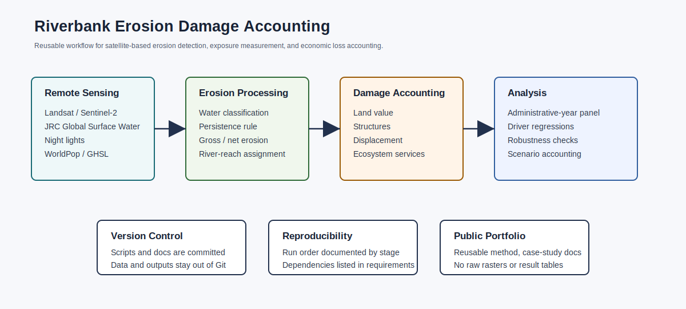
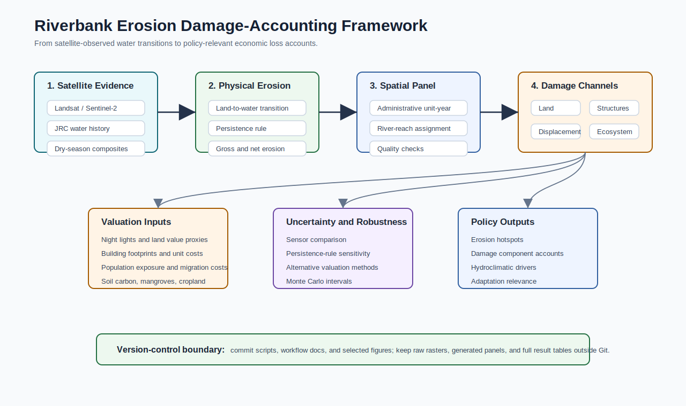
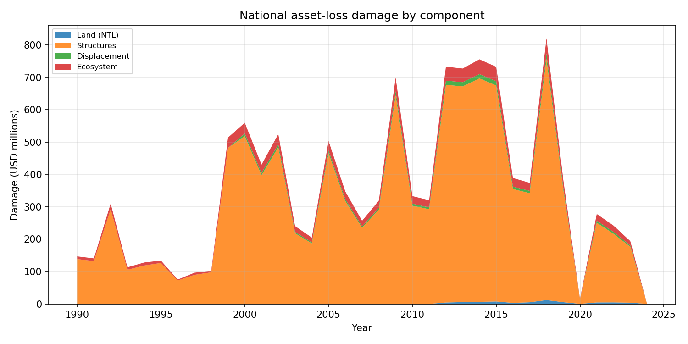
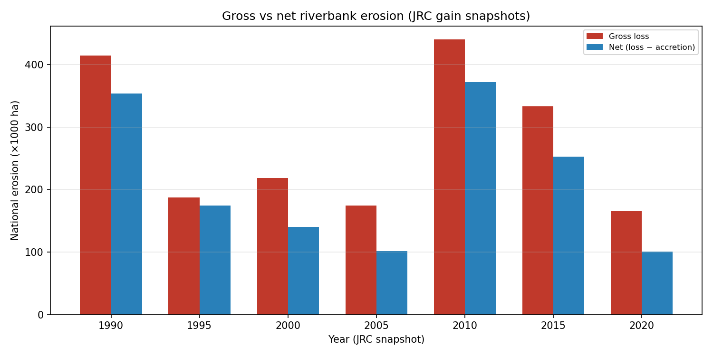

# Riverbank Erosion Damage Accounting

This repository contains a reproducible geospatial research pipeline for measuring riverbank erosion and translating observed land loss into economic damage accounts. The workflow combines satellite-derived erosion detection, administrative-unit aggregation, exposure layers, asset valuation, hydroclimatic drivers, and uncertainty analysis.

The repository is written as a generic methodological template. The included documentation uses Bangladesh as a case-study application, but the workflow is designed to be adapted to other river systems and delta regions.

## What This Demonstrates

- Google Earth Engine workflows for Landsat, Sentinel-2, JRC Global Surface Water, CHIRPS, WorldPop, GHSL, night lights, and related layers
- Python geospatial processing with `geopandas`, `rasterio`, `xarray`, and `statsmodels`
- Satellite-based erosion detection and validation
- Administrative-unit panel construction
- Economic damage accounting for land, structures, displacement, and ecosystem services
- Robustness checks, driver regressions, scenario accounting, and Monte Carlo uncertainty
- Version-controlled project organization for collaborative research

## Workflow



| Stage | Data product | Main scripts |
|---|---|---|
| 1. Remote-sensing exports | Water, erosion, population, buildings, cropland, night lights, and climate layers | `scripts/gee/` |
| 2. Erosion harmonization | Gross/net erosion by administrative unit, year, and river reach | `scripts/data_prep/process_jrc_erosion.py`, `scripts/data_prep/compute_net_erosion.py` |
| 3. Exposure and valuation | Land, structures, displacement, cropland, ecosystem-service, and infrastructure exposure | `scripts/data_prep/estimate_damage.py`, `scripts/data_prep/process_spam.py`, `scripts/data_prep/week7_osm_infrastructure.py` |
| 4. Panel construction | Administrative-unit by year damage-accounting panel | `scripts/data_prep/build_panel.py`, `scripts/data_prep/panel_quality_report.py` |
| 5. Analysis and uncertainty | Descriptive summaries, regressions, robustness, scenarios, and Monte Carlo intervals | `scripts/analysis/` |

## Selected Visuals

The repository includes a small set of public-facing visuals in `figures/selected/` to make the public portfolio easy to scan.







See `docs/VISUAL_GALLERY.md` for figure notes.

## Example Data Products

The repository includes small real-data extracts in `examples/`. These are limited documentation samples, not a full replication dataset or complete result-table release.

| Example file | Purpose |
|---|---|
| `examples/sample_erosion_panel.csv` | Administrative-unit-year erosion and exposure fields |
| `examples/sample_damage_by_year.csv` | National damage-accounting components by year |
| `examples/sample_river_system_summary.csv` | River-system erosion and damage summary |
| `examples/sample_dsas_retreat_summary.csv` | DSAS-style retreat-rate summary by river system |

See `docs/SAMPLE_TABLES.md` for a readable version.

## Repository Structure

```text
.
├── scripts/
│   ├── gee/          # Google Earth Engine export scripts
│   ├── data_prep/    # Geospatial processing and panel construction
│   └── analysis/     # Descriptive summaries, regressions, robustness, uncertainty
├── docs/             # Method notes and case-study documentation
├── data/             # Data note only; raw data are excluded
├── examples/         # Small real-data extracts from processed outputs
├── figures/selected/ # Small public-facing workflow visuals
├── requirements.txt
└── README.md
```

## Data

Raw data are not included. Several inputs are large geospatial rasters, external satellite products, or provider-hosted datasets. See `data/README.md` for data-source notes.

## Google Earth Engine at Scale

The GEE workflow is documented in `docs/GEE_WORKFLOW.md`, including the main Earth Engine products, export scripts, and downstream use of each exported layer.

## Installation

```bash
python -m venv .venv
source .venv/bin/activate
pip install -r requirements.txt
```

Google Earth Engine scripts require a configured Earth Engine account and project:

```bash
earthengine authenticate
```

## Reproducibility

See `docs/REPRODUCIBILITY.md` for the suggested run order and version-control rules.

## Public-Release Scope

This is a public code-portfolio version of an active research workflow. It includes scripts and documentation that demonstrate the methods, but excludes raw data, generated panels, manuscript drafts, and full unpublished result tables.
